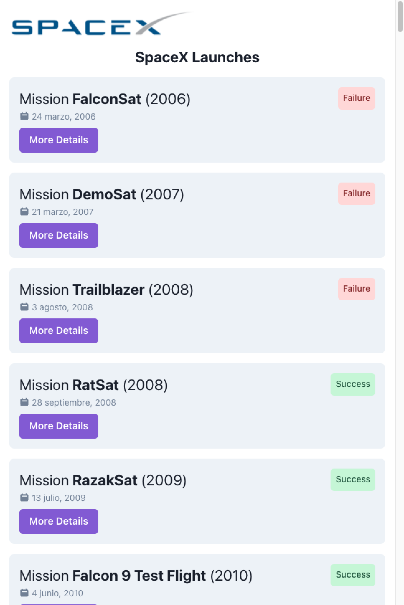

# Workshop React - SpaceX Missions

Aplicación React desde cero siguiento el taller de [Carlos Azaustre](https://github.com/carlosazaustre).

- Día 1: [YouTube](https://youtu.be/4AFOCAgywLc)
- Día 2: [Twitch](https://www.twitch.tv/videos/1446155826)

 

## Características

- Proyecto React creado con Vite
- Consultas al API de SpaceX ([docs](https://docs.spacexdata.com/))

## Bibliotecas

- Componentes: [Chakra UI](https://chakra-ui.com/)
- Iconos: [React Icons](https://react-icons.github.io/react-icons/)
- Gestión de fechas: [Day.js](https://day.js.org/)
- Rutas: [React Router](https://reactrouter.com/)

 

